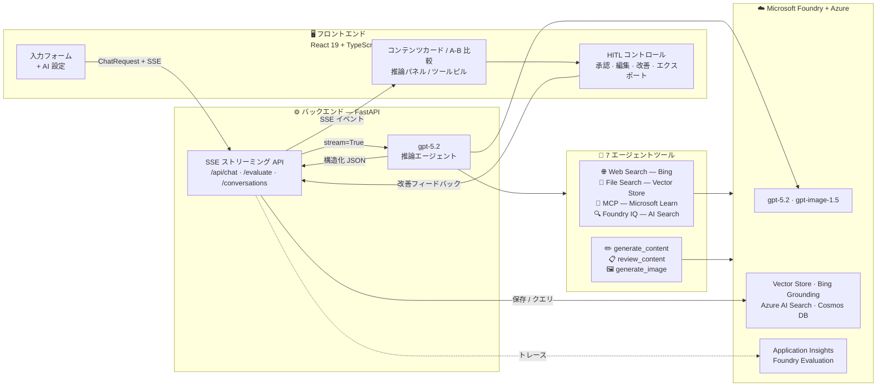
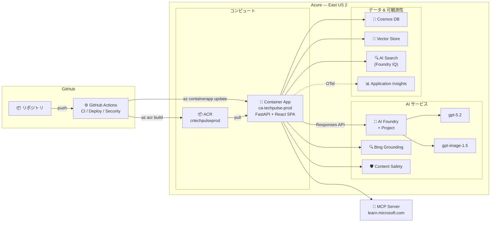

# Social AI Studio — AI ソーシャルメディアコンテンツスタジオ


> **Agents League @ TechConnect 2026** — Reasoning Agents トラック

🌐 [English](README.md) | **日本語**

マーケティング・広報チーム向け AI コンテンツ制作パイプライン。LinkedIn、X (Twitter)、Instagram にプラットフォーム最適化されたソーシャルメディアコンテンツを作成します。あらゆるブランド・業界に対応可能です。

**単一推論エージェント (gpt-5.2) × 7 ツール × 3 フェーズ思考パイプライン × 本番運用レベルのオブザーバビリティ**

## 🎬 デモ


*エンドツーエンドのコンテンツ生成パイプライン：トピック入力 → AI 設定 → 3 フェーズ推論（CoT → ReAct → Self-Reflection） → 7 ツール実行 → A/B コンテンツ比較 → バリアント選択 → プラットフォーム別コンテンツカード（LinkedIn / X）＋ AI 生成画像 → 品質レビュー（8.7/10） → HITL アクション → エクスポート*

## ✨ 主な機能一覧

| カテゴリ | 機能 |
| -------- | ---- |
| 🧠 **推論** | 3 フェーズパイプライン（CoT → ReAct → Self-Reflection）ライブフェーズバッジ + プログレスステッパー付き |
| 🔧 **7 エージェントツール** | Web Search, File Search, MCP Docs, Foundry IQ, Content Gen, Review, Image Gen |
| 🎯 **A/B コンテンツ比較** | 異なる戦略の 2 バリアント生成、サイドバイサイドレーダーチャート |
| 👤 **HITL ワークフロー** | プラットフォームカードごとに 承認 ✅ / 編集 ✏️ / 改善 🔄 |
| 📊 **品質スコアリング** | 5 軸レーダーチャート + Foundry Evaluation（関連性・一貫性・流暢性・根拠性） |
| 🔍 **オブザーバビリティ** | OpenTelemetry → Azure Application Insights → Foundry Tracing |
| 🛡️ **コンテンツ安全性** | Azure AI Content Safety（テキスト分析 + プロンプトシールド）リアルタイムバッジ |
| 🖼️ **画像生成** | gpt-image-1.5 によるプラットフォーム最適化ビジュアル（LinkedIn 1.91:1, Instagram 1:1） |
| 💾 **データ永続化** | Cosmos DB 会話履歴（インメモリフォールバック付き） |
| 🌐 **5 言語 i18n** | EN / JA / KO / ZH / ES フラグセレクター |
| 🌏 **バイリンガルモード** | EN + JA 同時コンテンツ生成（言語バッジ付き） |
| 📝 **15 コンテンツタイプ** | 製品ローンチ、ソートリーダーシップ、ケーススタディ、チュートリアル、カスタム自由入力など |
| 🌙 **ダーク / ライトモード** | システム設定連動テーマ切替 |
| ✨ **グラスモーフィズム UI** | フロストガラス、グラデーション、アニメーションツールピル |
| 🚀 **ワンコマンドデプロイ** | `azd up` → Azure Container Apps |
| ⚙️ **CI/CD パイプライン** | GitHub Actions: Lint → Test → Build → Deploy → Health Check |
| 🛡️ **セキュリティスキャン** | Trivy 脆弱性スキャン + Gitleaks シークレット検出 + 依存関係監査 |
| ✅ **123 ユニットテスト** | 包括的なバックエンドテストスイート |

## 🏗️ アーキテクチャ



### ☁️ Azure インフラストラクチャ



> 📄 リソース一覧の詳細 → [docs/ARCHITECTURE.md](docs/ARCHITECTURE.md)

## 🧠 推論パイプライン（3 フェーズ）

3 つの推論パターンがすべて**単一のシステムプロンプト**に統合されており、エージェントが各フェーズを自律的に進行します。UI には**ライブフェーズバッジ**がアクティブなステージを表示します：

| フェーズ | パターン | 動作内容 | UI 表示 |
| -------- | -------- | -------- | ------- |
| 1 | **Chain-of-Thought (CoT)** | 戦略分析 — トピック分解、ターゲット特定、キーメッセージ設計 | 💭 インディゴバッジ（パルス） |
| 2 | **ReAct (推論 + 行動)** | コンテンツ作成 — Web検索 → ファイル検索 → MCP → コンテンツ生成（推論とインターリーブ） | ⚡ アンバーバッジ（パルス） |
| 3 | **Self-Reflection** | 品質レビュー — 5 軸で自己評価、スコア 7 未満は修正 | 🔍 エメラルドバッジ（パルス） |

推論の深さ（`low` / `medium` / `high`）と思考表示（`off` / `auto` / `concise` / `detailed`）は AI 設定パネルから制御可能です。

## 🔧 エージェントツール（全 7 種）

| ツール | 種別 | 用途 |
| ------ | ---- | ---- |
| `web_search` | ホスト型（Bing Grounding） | リアルタイムトレンド調査・最新ニュース |
| `file_search` | ホスト型（Vector Store） | ブランドガイドラインに基づくグラウンディング |
| `mcp` | ホスト型（MCP Server） | Microsoft Learn ドキュメント — 技術的主張の検証 |
| `search_knowledge_base` | カスタム（@tool） | Foundry IQ Agentic Retrieval — 深いドキュメント検索 |
| `generate_content` | カスタム（@tool） | LinkedIn / X / Instagram ルールに基づくコンテンツ生成 |
| `review_content` | カスタム（@tool） | 5 軸品質スコアリング + 改善フィードバック |
| `generate_image` | カスタム（@tool） | gpt-image-1.5 ビジュアル生成 |

## 🔍 オブザーバビリティ & 評価

### OpenTelemetry + Azure Application Insights

推論パイプライン全体にわたる本番運用レベルの分散トレーシング：

- **パイプラインスパン** — エージェント実行全体をカバー（推論努力度、プラットフォーム、ツール数などの属性付き）
- **ツールスパン** — 各ツール呼び出しの個別スパン（開始 → 完了 + 所要時間）
- **自動計装** — FastAPI リクエスト、HTTP 呼び出し、Azure SDK 操作
- **エージェントフレームワーク計装** — agent-framework-core 内蔵の OTel サポート（`enable_instrumentation()`）

トレースの送信先：

- **Azure Application Insights** → エンドツーエンドのトランザクションビュー、ライブメトリクス
- **Microsoft Foundry** → オブザーバビリティ → トレース（エージェント実行と自動相関）

```python
# 自動セットアップ — .env に APPLICATIONINSIGHTS_CONNECTION_STRING を設定するだけ
from src.telemetry import setup_telemetry
setup_telemetry()  # FastAPI 初期化前に OTel → Azure Monitor を構成
```

### Foundry Evaluation（azure-ai-evaluation SDK）

生成コンテンツの AI 支援品質メトリクス：

| メトリクス | スケール | 測定内容 |
| ---------- | -------- | -------- |
| **Relevance** | 1-5 | コンテンツがユーザーのトピックに対応しているか |
| **Coherence** | 1-5 | コンテンツが論理的に構造化されているか |
| **Fluency** | 1-5 | 言語が自然で上手に書かれているか |
| **Groundedness** | 1-5 | コンテンツが提供されたコンテキストに基づいているか |

エージェント内蔵の 5 軸自己レビュー（ブランド整合性、プラットフォーム最適化、エンゲージメント可能性、事実精度、コンテンツ品質）を補完する**デュアル評価システム**。

## 🛡️ コンテンツ安全性

Azure AI Content Safety 統合による多層防御：

### 入力保護 — プロンプトシールド

- エージェント処理前にユーザー入力の**プロンプトインジェクション攻撃**を検出
- 悪意あるプロンプトを明確なエラーメッセージでブロック
- Azure AI Content Safety SDK の `ShieldPromptOptions` を使用

### 出力モデレーション — テキスト分析

- 生成コンテンツを **4 つの有害カテゴリ**で分析：Hate, SelfHarm, Sexual, Violence
- 設定可能な重大度しきい値（デフォルト：0-6 スケールで 2）
- SSE で `safety` イベントとして結果を送信 — UI に動的バッジ表示

### 安全性バッジ

- 🟢 **安全性確認済み** — すべてのカテゴリがしきい値未満
- 🔴 **安全性の問題** — 1 つ以上のカテゴリがフラグ
- ⚪ **確認中...** — 分析進行中

グレースフルオプション — `CONTENT_SAFETY_ENDPOINT` が未設定の場合、安全性チェックはスキップされ通常通りコンテンツが流れます。

## 👤 Human-in-the-Loop (HITL) ワークフロー

各プラットフォームコンテンツカードに以下の操作を搭載：

- **✅ 承認** — コンテンツを承認済みとしてマーク（ビジュアルスタンプ表示）
- **✏️ 編集** — インライン テキスト編集（保存/キャンセル付き）
- **🔄 改善** — AI エージェントに自然言語フィードバックを送信して特定箇所を改善

改善機能は同一会話スレッドにフォローアップメッセージを送信し、コンテキストを保持しながら特定プラットフォームのコンテンツを改善します。

## 🎯 A/B コンテンツ比較

AI 設定で A/B モードをオンにすると**異なる戦略の 2 つのコンテンツバリアント**を生成：

- ミニレーダーチャート付きサイドバイサイド比較カード
- 優位なバリアントにウィナーバッジ表示
- 選択したバリアントを展開してフル ContentCards ビュー（HITL / エクスポート機能付き）

## 📦 コンテンツエクスポート

- **📥 Markdown エクスポート** — コンテンツ、ハッシュタグ、CTA、品質スコア、ソース付きの構造化 `.md`
- **📥 JSON エクスポート** — CMS 連携用の生構造化出力

## 🛠️ 技術スタック

| レイヤー | テクノロジー |
| -------- | ------------ |
| **モデル** | gpt-5.2（推論）、gpt-image-1.5（画像生成） |
| **プラットフォーム** | Microsoft Foundry |
| **エージェント SDK** | agent-framework-core（Responses API + `@tool` デコレータ） |
| **グラウンディング** | File Search（Vector Store）、Web Search（Bing）、MCP（Microsoft Learn）、Foundry IQ（Agentic Retrieval） |
| **オブザーバビリティ** | OpenTelemetry → Azure Application Insights → Foundry Tracing |
| **評価** | azure-ai-evaluation SDK（Relevance, Coherence, Fluency, Groundedness） |
| **データベース** | Azure Cosmos DB（会話履歴、インメモリフォールバック） |
| **認証** | DefaultAzureCredential（Azure CLI / マネージド ID） |
| **バックエンド** | FastAPI + uvicorn（SSE ストリーミング） |
| **フロントエンド** | React 19 + TypeScript 5 + Vite 7 + Tailwind CSS v3 |
| **UI コンポーネント** | lucide-react アイコン、react-markdown、recharts（レーダーチャート） |
| **デプロイ** | Azure Container Apps via azd（マルチステージ Docker ビルド） |
| **CI/CD** | GitHub Actions（CI + Deploy + Security Scan） |
| **パッケージマネージャ** | uv（Python）、npm（Node.js） |
| **テスト** | pytest + pytest-asyncio（123 テスト） |

## 🚀 クイックスタート

### 前提条件

- Python 3.12+ と [uv](https://docs.astral.sh/uv/)
- Node.js 20+
- Azure CLI ログイン済み（`az login`）
- gpt-5.2 および gpt-image-1.5 デプロイメントがある Microsoft Foundry プロジェクト
- Foundry プロジェクトに Bing Grounding 接続を構成済み

### セットアップ

```bash
# クローン
git clone https://github.com/naoki1213mj/social-ai-studio.git
cd social-ai-studio

# 環境変数
cp .env.example .env
# .env を編集して PROJECT_ENDPOINT を設定

# バックエンド
uv sync
uv run python -m src.api
# Vector Store は初回起動時に自動作成されます

# フロントエンド（別ターミナル）
cd frontend
npm install
npx vite
```

ブラウザで <http://localhost:5173> を開きます。

### Azure へのデプロイ

[Azure Developer CLI (azd)](https://learn.microsoft.com/azure/developer/azure-developer-cli/) を使って Azure Container Apps にワンコマンドデプロイ：

```bash
azd auth login
azd up
```

マルチステージ Docker イメージ（Node.js フロントエンド → Python バックエンド）をビルドし、マネージド ID 付きで Azure Container Apps にデプロイします。

### CI/CD パイプライン（GitHub Actions）

`main` ブランチへの push で完全なパイプラインが自動実行されます：

```
git push → Lint (Ruff) → Test (123 pytest) → Build (ACR) → Deploy (Container Apps) → Health Check
```

| ワークフロー | トリガー | 説明 |
| ------------ | -------- | ---- |
| **CI** (`ci.yml`) | push / PR | Ruff lint + pytest + TypeScript 型チェック |
| **Deploy** (`deploy.yml`) | main への push | Docker ビルド → ACR → Container App 更新 |
| **Security** (`security.yml`) | push / PR / 毎週 | Trivy + Gitleaks + 依存関係監査 |

詳細は [docs/ARCHITECTURE.md](docs/ARCHITECTURE.md) を参照してください。

### 環境変数

| 変数名 | 説明 | 必須 |
| ------ | ---- | ---- |
| `PROJECT_ENDPOINT` | Microsoft Foundry プロジェクトエンドポイント | **はい** |
| `MODEL_DEPLOYMENT_NAME` | 推論モデルデプロイメント | **はい** |
| `IMAGE_DEPLOYMENT_NAME` | 画像モデルデプロイメント | **はい** |
| `VECTOR_STORE_ID` | 初回実行時に自動生成 | いいえ |
| `COSMOS_ENDPOINT` | Cosmos DB エンドポイント | いいえ |
| `COSMOS_DATABASE` | Cosmos DB データベース名 | いいえ |
| `COSMOS_CONTAINER` | Cosmos DB コンテナ名 | いいえ |
| `AI_SEARCH_ENDPOINT` | Azure AI Search エンドポイント（Foundry IQ） | いいえ |
| `AI_SEARCH_KNOWLEDGE_BASE_NAME` | ナレッジベース名 | いいえ |
| `AI_SEARCH_API_KEY` | AI Search 管理キー（MI 使用時は不要） | いいえ |
| `AI_SEARCH_REASONING_EFFORT` | 検索推論レベル（minimal/low/medium） | いいえ |
| `APPLICATIONINSIGHTS_CONNECTION_STRING` | 分散トレーシング用 App Insights | いいえ |
| `CONTENT_SAFETY_ENDPOINT` | Azure AI Content Safety エンドポイント | いいえ |
| `OTEL_SERVICE_NAME` | OpenTelemetry サービス名 | いいえ |
| `EVAL_MODEL_DEPLOYMENT` | Foundry Evaluation 用モデル | いいえ |
| `DEBUG` | デバッグログ有効化 | いいえ |

## 📁 プロジェクト構成

```text
├── src/
│   ├── config.py            # 環境設定
│   ├── client.py            # AzureOpenAIResponsesClient シングルトン
│   ├── agent.py             # エージェント作成、推論パイプライン、SSE ストリーミング、OTel トレーシング
│   ├── tools.py             # カスタムツール: generate_content, review_content, generate_image
│   ├── vector_store.py      # Vector Store 自動作成 & File Search プロビジョニング
│   ├── database.py          # Cosmos DB 会話履歴（インメモリフォールバック）
│   ├── agentic_retrieval.py # Foundry IQ Agentic Retrieval ツール
│   ├── telemetry.py         # OpenTelemetry + Azure Monitor セットアップ
│   ├── evaluation.py        # Foundry Evaluation 統合（azure-ai-evaluation）
│   ├── content_safety.py    # Azure AI Content Safety（テキスト分析 + プロンプトシールド）
│   ├── models.py            # Pydantic データモデル
│   ├── prompts/
│   │   └── system_prompt.py # 3 フェーズ推論プロンプト（CoT + ReAct + Self-Reflection）
│   └── api.py               # FastAPI エンドポイント（SSE ストリーミング、評価、静的配信）
├── frontend/
│   ├── src/
│   │   ├── App.tsx               # メインアプリ（HITL + リトライ + 経過タイマー）
│   │   ├── components/
│   │   │   ├── InputForm.tsx     # トピック入力 + AI 設定パネル（15 コンテンツタイプ + カスタム）
│   │   │   ├── ContentCards.tsx  # プラットフォームカード + HITL + エクスポート + Foundry 評価
│   │   │   ├── ContentDisplay.tsx # JSON → カードパーサー + スケルトン
│   │   │   ├── PhasesStepper.tsx  # 3 フェーズパイプラインプログレスインジケーター
│   │   │   ├── ReasoningPanel.tsx # 折りたたみパネル + フェーズバッジ
│   │   │   ├── ToolEvents.tsx    # アニメーションツール使用ピル
│   │   │   ├── ABCompareCards.tsx # A/B バリアント比較
│   │   │   ├── HistorySidebar.tsx # 会話履歴
│   │   │   ├── SuggestedQuestions.tsx
│   │   │   └── Header.tsx
│   │   ├── hooks/            # useTheme, useI18n
│   │   └── lib/              # api.ts（SSE クライアント）, i18n.ts（5 言語）
│   ├── vite.config.ts
│   └── package.json
├── tests/                    # 123 ユニットテスト（pytest + pytest-asyncio）
├── infra/
│   ├── main.bicep            # Azure インフラ（ACR + Container Apps）
│   └── main.parameters.json
├── data/
│   └── brand_guidelines.md   # サンプルブランドガイド（Vector Store にアップロード）
├── .github/
│   ├── copilot-instructions.md  # Copilot カスタムインストラクション
│   ├── instructions/            # セキュリティ・Python ルール
│   └── workflows/               # GitHub Actions（CI / Deploy / Security）
├── docs/
│   ├── ARCHITECTURE.md      # Azure アーキテクチャドキュメント
│   ├── DESIGN.md             # アーキテクチャ設計ドキュメント
│   └── SPEC.md               # 技術仕様書
├── Dockerfile                # マルチステージビルド（Node フロントエンド + Python バックエンド）
├── azure.yaml                # Azure Developer CLI プロジェクト設定
├── pyproject.toml
└── .env.example
```

## 📋 API リファレンス

### `POST /api/chat` — ストリーミングチャット

```json
{
  "message": "AIの最新トレンドについて",
  "platforms": ["linkedin", "x", "instagram"],
  "content_type": "tech_insight",
  "language": "ja",
  "reasoning_effort": "high",
  "reasoning_summary": "detailed",
  "ab_mode": false,
  "bilingual": false
}
```

SSE ストリームを返します：

- `{"type": "reasoning_update", "reasoning": "..."}` — 思考トークン
- `__TOOL_EVENT__...__END_TOOL_EVENT__` — ツール使用イベント
- `{"choices": [...], "thread_id": "..."}` — コンテンツチャンク
- `{"type": "safety", "safety": {...}}` — コンテンツ安全性分析結果
- `{"type": "done"}` — 完了シグナル

### `POST /api/evaluate` — コンテンツ品質評価

```json
{
  "query": "AI trends 2026",
  "response": "生成されたコンテンツテキスト...",
  "context": "オプションのグラウンディングコンテキスト..."
}
```

戻り値: `{"relevance": 4.5, "coherence": 5.0, "fluency": 4.0, "groundedness": 4.5}`

### `POST /api/safety` — コンテンツ安全性分析

```json
{
  "text": "分析対象のテキスト...",
  "check_prompt_injection": true
}
```

戻り値: `{"safe": true, "categories": {...}, "prompt_shield": {...}, "summary": "..."}`

### `GET /api/health`

```json
{"status": "ok", "service": "social-ai-studio", "version": "0.4.0", "observability": "opentelemetry", "content_safety": "enabled"}
```

### その他のエンドポイント

- `GET /api/conversations` — 全会話一覧
- `GET /api/conversations/{id}` — メッセージ付き会話取得
- `DELETE /api/conversations/{id}` — 会話削除

## ✨ フロントエンド機能

### コンテンツ & 生成

- **プラットフォームコンテンツカード** — LinkedIn（青）、X（グレー）、Instagram（ピンク）カードごとコピー
- **推論フェーズバッジ** — CoT → ReAct → Self-Reflection のライブインジケーター（パルスアニメーション）
- **3 フェーズプログレスステッパー** — 常時表示のパイプライン進捗インジケーター（CoT → ReAct → Self-Reflection）
- **ツール使用ピル** — グラデーショングロー付きアニメーションバッジ（Web Search, File Search, MCP 等）
- **品質レーダーチャート** — recharts による 5 軸ビジュアライゼーション + 総合スコア
- **コンテンツ安全性バッジ** — Azure AI Content Safety 分析に基づく動的バッジ
- **処理メトリクス** — 生成後の統計バー（推論文字数、使用ツール数、出力文字数）
- **A/B 比較カード** — ミニレーダーチャートとウィナーバッジ付きサイドバイサイド

### インタラクション

- **HITL コントロール** — カードごとの承認 / 編集 / 改善（インライン編集）
- **会話履歴** — 折りたたみ可能なサイドバーと永続的な会話リスト
- **コンテンツエクスポート** — Markdown（.md）または JSON でダウンロード
- **停止 / リトライ** — ワンクリックで生成中断または再試行
- **キーボードショートカット** — Ctrl+Enter で送信、Escape で停止
- **おすすめ質問** — 空状態グリッドにクリック可能な 4 つのサンプル

### デザイン

- **グラスモーフィズム UI** — フロストガラスカード、グラデーション背景、バックドロップブラー
- **グラデーションデザイン** — アニメーショングラデーションボーダー、ブランドグラデーションヘッダー
- **スケルトンローディング** — 生成中のシマープレースホルダー
- **カードアニメーション** — コンテンツカード出現時のスタガードフェードイン
- **プラットフォーム別画像** — LinkedIn/X 横長（1.91:1）、Instagram 正方形（1:1）寸法ラベル付き
- **15 コンテンツタイプ** — カスタム自由入力含むあらゆる投稿パターンに対応
- **バイリンガルモード** — EN + JA トグル（コンテンツカードに言語バッジ表示）
- **Foundry 評価ボタン** — ワンクリック「Evaluate with Foundry」（関連性・一貫性・流暢性・根拠性の 4 軸スコア）
- **ダーク / ライトモード** — システム設定連動
- **5 言語 i18n** — EN / JA / KO / ZH / ES（フラグセレクター）

## 🏆 審査基準マッピング

| 基準 | 配分 | Social AI Studio の対応 |
| ---- | ---- | ----------------------- |
| **正確性 & 関連性** | 25% | 7 ツール（Web検索、ファイル検索、MCP、Foundry IQ、コンテンツ生成、レビュー、画像生成）、Vector Store によるブランドグラウンディング、Foundry Evaluation（関連性 + 根拠性スコアリング）、デュアル品質評価 |
| **推論 & マルチステップ思考** | 25% | 3 フェーズパイプライン（CoT → ReAct → Self-Reflection）、ライブフェーズバッジ、制御可能な深さ（low/medium/high）、OpenTelemetry による推論パイプラインのトレーシング（ツール別スパン） |
| **創造性 & 独自性** | 20% | HITL ワークフロー（承認/編集/改善）、A/B コンテンツ比較（戦略バリアント）、推論フェーズ可視化、GPT 画像生成、MCP Server 統合、デュアル評価システム（自己レビュー + Foundry メトリクス） |
| **ユーザー体験 & プレゼン** | 15% | フロストガラス UI + アニメーション、ダーク/ライトモード、5 言語 i18n、スケルトンローディング、おすすめ質問、キーボードショートカット、会話履歴、コンテンツエクスポート（Markdown + JSON） |
| **技術実装** | 15% | agent-framework-core SDK、OTel 分散トレーシング付き SSE ストリーミング、Cosmos DB 永続化、azd 経由 Azure Container Apps デプロイ、GitHub Actions CI/CD（lint → test → build → deploy → security scan）、123 ユニットテスト、OpenTelemetry → Application Insights パイプライン、Foundry Evaluation SDK 統合 |

## 🧪 テスト

```bash
# 全 123 テスト実行
uv run python -m pytest tests/ -q

# 詳細出力
uv run python -m pytest tests/ -v

# カバレッジ付き
uv run python -m pytest tests/ --cov=src --cov-report=term-missing
```

## ライセンス

[MIT License](LICENSE)
