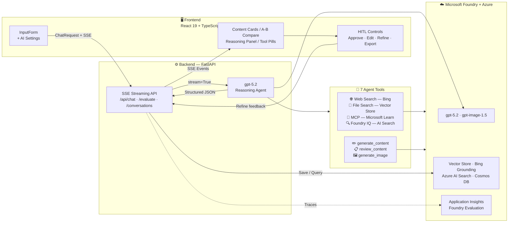
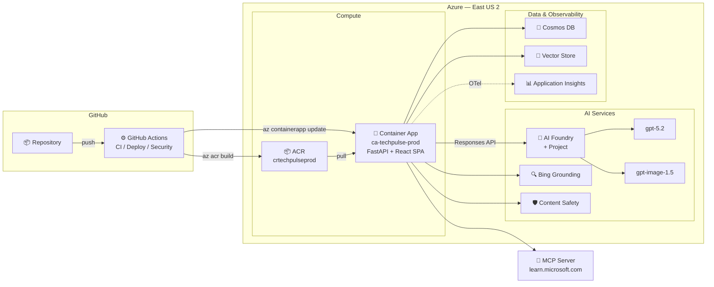

# Social AI Studio — AI-Powered Social Media Content Studio


> **Agents League @ TechConnect 2026** — Reasoning Agents Track

🌐 **English** | [日本語](README.ja.md)

An AI-powered content creation pipeline that assists marketing and communication teams in creating platform-optimized social media content for LinkedIn, X (Twitter), and Instagram — adaptable to any brand or industry.

## 🚀 Snapshot

Single reasoning agent (gpt-5.2) × 7 tools × 3-phase thinking pipeline × production-grade observability.

## 🎬 Demo Video

<!-- TODO: Add demo video link after recording -->
Coming soon — 3 min walkthrough of the full reasoning pipeline.

## ✨ Key Features at a Glance

| Category | Feature |
|----------|---------|
| 🧠 **Reasoning** | 3-phase pipeline (CoT → ReAct → Self-Reflection) with live phase badges |
| 🔧 **7 Agent Tools** | Web Search, File Search, MCP Docs, Foundry IQ, Content Gen, Review, Image Gen |
| 🎯 **A/B Comparison** | Two content variants with different strategies, side-by-side radar charts |
| 👤 **HITL Workflow** | Approve ✅ / Edit ✏️ / Refine 🔄 per platform card |
| 📊 **Quality Scoring** | 5-axis radar chart + Foundry Evaluation (Relevance, Coherence, Fluency, Groundedness) |
| 🔍 **Observability** | OpenTelemetry → Azure Application Insights → Foundry Tracing |
| 🛡️ **Content Safety** | Azure AI Content Safety (text analysis + prompt shield) with real-time badge |
| 🖼️ **Image Generation** | gpt-image-1.5 creates platform-optimized visuals |
| 💾 **Persistence** | Cosmos DB conversation history with in-memory fallback |
| 🌐 **5-Language i18n** | EN / JA / KO / ZH / ES with flag-based selector |
| 🌙 **Dark / Light Mode** | System-preference-aware theme switching |
| ✨ **Glassmorphism UI** | Frosted glass, gradient borders, animated tool pills |
| 🚀 **One-Command Deploy** | `azd up` → Azure Container Apps |
| ⚙️ **CI/CD Pipeline** | GitHub Actions: Lint → Test → Build → Deploy → Health Check |
| 🛡️ **Security Scanning** | Trivy vulnerability scan + Gitleaks secret detection + dependency audit |
| ✅ **123 Unit Tests** | Comprehensive backend test suite |

## 🏗️ Architecture



### ☁️ Azure Infrastructure



> 📄 Full resource inventory → [docs/ARCHITECTURE.md](docs/ARCHITECTURE.md)

## 🧠 Reasoning Pipeline (3-Phase)

All three reasoning patterns are integrated into a **single system prompt** — the agent autonomously progresses through each phase. The UI displays **live phase badges** that highlight the active stage:

| Phase | Pattern | What Happens | UI Indicator |
|-------|---------|-------------|-------------|
| 1 | **Chain-of-Thought (CoT)** | Strategic analysis — topic decomposition, audience identification, key message planning | 💭 Indigo badge (pulsing) |
| 2 | **ReAct (Reasoning + Acting)** | Content creation — web search → file search → MCP docs → content generation, interleaved with reasoning | ⚡ Amber badge (pulsing) |
| 3 | **Self-Reflection** | Quality review — self-evaluate on 5 axes, revise if any score < 7 | 🔍 Emerald badge (pulsing) |

The user controls reasoning depth (`low`/`medium`/`high`) and thinking display (`off`/`auto`/`concise`/`detailed`) via the AI Settings panel.

## 🔧 Agent Tools (7 Total)

| Tool | Type | Purpose |
|------|------|---------|
| `web_search` | Hosted (Bing Grounding) | Real-time trend research and latest news |
| `file_search` | Hosted (Vector Store) | Brand guidelines grounding |
| `mcp` | Hosted (MCP Server) | Microsoft Learn docs — technical claim verification |
| `search_knowledge_base` | Custom (@tool) | Foundry IQ Agentic Retrieval — deep document search |
| `generate_content` | Custom (@tool) | Platform-optimized content generation with LinkedIn/X/Instagram rules |
| `review_content` | Custom (@tool) | 5-axis quality scoring + improvement feedback |
| `generate_image` | Custom (@tool) | gpt-image-1.5 visual generation |

## 🔍 Observability & Evaluation

### OpenTelemetry + Azure Application Insights

Production-grade distributed tracing across the entire reasoning pipeline:

- **Pipeline span** — covers the full agent execution with attributes (reasoning effort, platforms, tool count)
- **Tool spans** — individual spans for each tool invocation (start → complete with duration)
- **Auto-instrumented** — FastAPI requests, HTTP calls, Azure SDK operations
- **Agent framework instrumentation** — agent-framework-core's built-in OTel support via `enable_instrumentation()`

Traces flow to:

- **Azure Application Insights** → End-to-end transaction view, Live Metrics
- **Microsoft Foundry** → Observability → Traces (auto-correlated with agent runs)

```python
# Automatic setup — just set APPLICATIONINSIGHTS_CONNECTION_STRING in .env
from src.telemetry import setup_telemetry
setup_telemetry()  # Configures OTel → Azure Monitor before FastAPI init
```

### Foundry Evaluation (azure-ai-evaluation SDK)

AI-assisted quality metrics for generated content:

| Metric | Scale | What It Measures |
|--------|-------|-----------------|
| **Relevance** | 1-5 | Does the content address the user's topic? |
| **Coherence** | 1-5 | Is the content logically structured? |
| **Fluency** | 1-5 | Is the language natural and well-written? |
| **Groundedness** | 1-5 | Is the content grounded in provided context? |

These complement the agent's built-in 5-axis self-review (brand alignment, platform optimization, engagement potential, factual accuracy, content quality) for a **dual evaluation system**.

## 🛡️ Content Safety

Azure AI Content Safety integration provides multi-layered protection:

### Input Protection — Prompt Shield

- Detects **prompt injection attacks** in user input before agent processing
- Blocks malicious prompts with clear error messages
- Uses `ShieldPromptOptions` from Azure AI Content Safety SDK

### Output Moderation — Text Analysis

- Analyzes generated content across **4 harm categories**: Hate, SelfHarm, Sexual, Violence
- Configurable severity threshold (default: 2 on 0-6 scale)
- Results sent via SSE as a `safety` event — dynamic badge in the UI

### Safety Badge

- 🟢 **Content Safe** — All categories below threshold
- 🔴 **Safety Issue** — One or more categories flagged
- ⚪ **Checking...** — Analysis in progress

Gracefully optional — if `CONTENT_SAFETY_ENDPOINT` is not set, safety checks are skipped and content flows normally.

## 👤 Human-in-the-Loop (HITL) Workflow

Each platform content card includes:

- **✅ Approve** — Mark content as approved (visual stamp appears)
- **✏️ Edit** — Inline text editing with save/cancel
- **🔄 Refine** — Send natural language feedback to the AI agent for targeted improvement

The Refine feature sends a follow-up message to the same conversation thread, allowing the agent to improve specific platform content while preserving context.

## 🎯 A/B Content Comparison

Toggle A/B mode in AI Settings to generate **two content variants with different strategies**:

- Side-by-side comparison cards with mini radar charts
- Winner badge highlighting the stronger variant
- Select preferred variant to expand into full ContentCards view with all HITL/export features

## 📦 Content Export

- **📥 Export as Markdown** — Structured `.md` with content, hashtags, CTAs, quality scores, and sources
- **📥 Export as JSON** — Raw structured output for CMS integration

## 🛠️ Tech Stack

| Layer | Technology |
|-------|-----------|
| **Models** | gpt-5.2 (reasoning), gpt-image-1.5 (image generation) |
| **Platform** | Microsoft Foundry |
| **Agent SDK** | agent-framework-core (Responses API + `@tool` decorator) |
| **Grounding** | File Search (Vector Store), Web Search (Bing), MCP (Microsoft Learn), Foundry IQ (Agentic Retrieval) |
| **Observability** | OpenTelemetry → Azure Application Insights → Foundry Tracing |
| **Evaluation** | azure-ai-evaluation SDK (Relevance, Coherence, Fluency, Groundedness) |
| **Database** | Azure Cosmos DB (conversation history, in-memory fallback) |
| **Auth** | DefaultAzureCredential (Azure CLI / Managed Identity) |
| **Backend** | FastAPI + uvicorn (SSE streaming) |
| **Frontend** | React 19 + TypeScript 5 + Vite 7 + Tailwind CSS v3 |
| **UI Components** | lucide-react icons, react-markdown, recharts (radar charts) |
| **Deployment** | Azure Container Apps via azd (multi-stage Docker build) |
| **CI/CD** | GitHub Actions (CI + Deploy + Security Scan) |
| **Package Mgr** | uv (Python), npm (Node.js) |
| **Testing** | pytest + pytest-asyncio (123 tests) |

## 🚀 Quick Start

### Prerequisites

- Python 3.12+ with [uv](https://docs.astral.sh/uv/)
- Node.js 20+
- Azure CLI logged in (`az login`)
- Access to a Microsoft Foundry project with gpt-5.2 and gpt-image-1.5 deployments
- Bing Grounding connection configured in the Foundry project

### Setup

```bash
# Clone
git clone https://github.com/naoki1213mj/social-ai-studio.git
cd social-ai-studio

# Environment variables
cp .env.example .env
# Edit .env with your PROJECT_ENDPOINT

# Backend
uv sync
uv run python -m src.api
# Vector Store is auto-created on first startup

# Frontend (separate terminal)
cd frontend
npm install
npx vite
```

Open <http://localhost:5173> in your browser.

### Deploy to Azure

Deploy to Azure Container Apps with a single command using [Azure Developer CLI (azd)](https://learn.microsoft.com/azure/developer/azure-developer-cli/):

```bash
azd auth login
azd up
```

This builds a multi-stage Docker image (Node.js frontend → Python backend) and deploys it to Azure Container Apps with managed identity.

### CI/CD Pipeline (GitHub Actions)

Push to `main` triggers the full pipeline automatically:

```
git push → Lint (Ruff) → Test (123 pytest) → Build (ACR) → Deploy (Container Apps) → Health Check
```

| Workflow | Trigger | Description |
|----------|---------|-------------|
| **CI** (`ci.yml`) | push / PR | Ruff lint + pytest + TypeScript type check |
| **Deploy** (`deploy.yml`) | push to main | Docker build → ACR → Container App update |
| **Security** (`security.yml`) | push / PR / weekly | Trivy + Gitleaks + dependency audit |

See [docs/ARCHITECTURE.md](docs/ARCHITECTURE.md) for the full Azure architecture documentation.

### Environment Variables

| Variable | Description | Required |
|----------|-------------|----------|
| `PROJECT_ENDPOINT` | Microsoft Foundry project endpoint | **Yes** |
| `MODEL_DEPLOYMENT_NAME` | Reasoning model deployment | **Yes** |
| `IMAGE_DEPLOYMENT_NAME` | Image model deployment | **Yes** |
| `VECTOR_STORE_ID` | Auto-generated on first run | No |
| `COSMOS_ENDPOINT` | Cosmos DB endpoint | No |
| `COSMOS_DATABASE` | Cosmos DB database name | No |
| `COSMOS_CONTAINER` | Cosmos DB container name | No |
| `AI_SEARCH_ENDPOINT` | Azure AI Search endpoint (Foundry IQ) | No |
| `AI_SEARCH_KNOWLEDGE_BASE_NAME` | Knowledge Base name | No |
| `APPLICATIONINSIGHTS_CONNECTION_STRING` | App Insights for distributed tracing | No |
| `OTEL_SERVICE_NAME` | OpenTelemetry service name | No |
| `EVAL_MODEL_DEPLOYMENT` | Model for Foundry Evaluation | No |
| `DEBUG` | Enable debug logging | No |

## 📁 Project Structure

```text
├── .github/
│   ├── copilot-instructions.md  # Copilot custom instructions
│   ├── instructions/            # Security & Python-Foundry rules
│   └── workflows/               # GitHub Actions (CI / Deploy / Security)
├── src/
│   ├── config.py            # Environment configuration
│   ├── client.py            # AzureOpenAIResponsesClient singleton
│   ├── agent.py             # Agent creation, reasoning pipeline, SSE streaming, OTel tracing
│   ├── tools.py             # Custom tools: generate_content, review_content, generate_image
│   ├── vector_store.py      # Vector Store auto-creation & File Search provisioning
│   ├── database.py          # Cosmos DB conversation history (in-memory fallback)
│   ├── agentic_retrieval.py # Foundry IQ Agentic Retrieval tool
│   ├── telemetry.py         # OpenTelemetry + Azure Monitor setup
│   ├── evaluation.py        # Foundry Evaluation integration (azure-ai-evaluation)
│   ├── content_safety.py    # Azure AI Content Safety (text analysis + prompt shield)
│   ├── models.py            # Pydantic data models
│   ├── prompts/
│   │   └── system_prompt.py # 3-phase reasoning prompt (CoT + ReAct + Self-Reflection)
│   └── api.py               # FastAPI endpoints (SSE streaming, evaluation, static serving)
├── frontend/
│   ├── src/
│   │   ├── App.tsx               # Main application w/ HITL + retry + elapsed timer
│   │   ├── components/
│   │   │   ├── InputForm.tsx     # Topic input + AI Settings panel
│   │   │   ├── ContentCards.tsx  # Platform cards + HITL controls + Export
│   │   │   ├── ContentDisplay.tsx # JSON → Cards parser + Skeleton
│   │   │   ├── ReasoningPanel.tsx # Collapsible panel + Phase Badges
│   │   │   ├── ToolEvents.tsx    # Animated tool usage pills
│   │   │   ├── ABCompareCards.tsx # A/B variant comparison
│   │   │   ├── HistorySidebar.tsx # Conversation history
│   │   │   ├── SuggestedQuestions.tsx
│   │   │   └── Header.tsx
│   │   ├── hooks/            # useTheme, useI18n
│   │   └── lib/              # api.ts (SSE client), i18n.ts (5 languages)
│   ├── vite.config.ts
│   └── package.json
├── tests/                    # 123 unit tests (pytest + pytest-asyncio)
├── infra/
│   ├── main.bicep            # Azure infrastructure (ACR + Container Apps)
│   └── main.parameters.json
├── data/
│   └── brand_guidelines.md   # Sample brand guide (uploaded to Vector Store)
├── docs/
│   ├── ARCHITECTURE.md      # Azure architecture documentation
│   ├── DESIGN.md             # Architecture design document
│   └── SPEC.md               # Technical specification
├── Dockerfile                # Multi-stage build (Node frontend + Python backend)
├── azure.yaml                # Azure Developer CLI project config
├── pyproject.toml
└── .env.example
```

## 📋 API Reference

### `POST /api/chat` — Streaming Chat

```json
{
  "message": "AIの最新トレンドについて",
  "platforms": ["linkedin", "x", "instagram"],
  "content_type": "tech_insight",
  "language": "ja",
  "reasoning_effort": "high",
  "reasoning_summary": "detailed",
  "ab_mode": false
}
```

Returns SSE stream:

- `{"type": "reasoning_update", "reasoning": "..."}` — Thinking tokens
- `__TOOL_EVENT__...__END_TOOL_EVENT__` — Tool usage events
- `{"choices": [...], "thread_id": "..."}` — Content chunks
- `{"type": "safety", "safety": {...}}` — Content Safety analysis result
- `{"type": "done"}` — Completion signal

### `POST /api/evaluate` — Content Quality Evaluation

```json
{
  "query": "AI trends 2026",
  "response": "Generated content text...",
  "context": "Optional grounding context..."
}
```

Returns: `{"relevance": 4.5, "coherence": 5.0, "fluency": 4.0, "groundedness": 4.5}`

### `POST /api/safety` — Content Safety Analysis

```json
{
  "text": "Text to analyze...",
  "check_prompt_injection": true
}
```

Returns: `{"safe": true, "categories": {...}, "prompt_shield": {...}, "summary": "..."}`

### `GET /api/health`

```json
{"status": "ok", "service": "social-ai-studio", "version": "0.4.0", "observability": "opentelemetry", "content_safety": "enabled"}
```

### Other Endpoints

- `GET /api/conversations` — List all conversations
- `GET /api/conversations/{id}` — Get conversation with messages
- `DELETE /api/conversations/{id}` — Delete conversation

## ✨ Frontend Features

### Content & Generation

- **Platform Content Cards** — LinkedIn (blue), X (gray), Instagram (pink) with per-card copy
- **Reasoning Phase Badges** — Live CoT → ReAct → Self-Reflection indicators with pulse animation
- **Tool Usage Pills** — Animated gradient-glow badges (Web Search, File Search, MCP, Content Gen, etc.)
- **Quality Radar Chart** — 5-axis recharts visualization with overall score
- **Content Safety Badge** — Dynamic badge based on Azure AI Content Safety analysis
- **Processing Metrics** — Post-generation stats bar (reasoning chars, tools used, output chars)
- **A/B Compare Cards** — Side-by-side variants with mini radar charts and winner badge

### Interaction

- **HITL Controls** — Approve / Edit / Refine per card with inline editing
- **Conversation History** — Collapsible sidebar with persistent conversation list
- **Content Export** — Download as Markdown (.md) or JSON
- **Stop / Retry** — Abort or retry generation with one click
- **Keyboard Shortcuts** — Ctrl+Enter to submit, Escape to stop
- **Suggested Questions** — Empty-state grid with 4 clickable examples

### Design

- **Glassmorphism UI** — Frosted glass cards, gradient backgrounds, backdrop blur
- **Gradient Design** — Animated gradient borders, brand gradient header
- **Skeleton Loading** — Shimmer placeholders during generation
- **Card Animations** — Staggered fade-in on content card appearance
- **Dark / Light Mode** — System-preference-aware
- **5-Language i18n** — EN / JA / KO / ZH / ES with flag selector

## 🏆 Judging Criteria Mapping

| Criteria | Weight | How Social AI Studio Addresses It |
|----------|--------|-----------------------------------|
| **Accuracy & Relevance** | 25% | 7 tools (web search, file search, MCP, Foundry IQ, content gen, review, image gen), brand grounding via Vector Store, Foundry Evaluation (Relevance + Groundedness scoring), dual quality assessment |
| **Reasoning & Multi-step Thinking** | 25% | 3-phase pipeline (CoT → ReAct → Self-Reflection), live phase badges, controllable depth (low/medium/high), OpenTelemetry tracing of reasoning pipeline with per-tool spans |
| **Creativity & Originality** | 20% | HITL workflow (approve/edit/refine), A/B content comparison with strategy variants, reasoning phase visualization, GPT Image generation, MCP Server integration, dual evaluation system (self-review + Foundry metrics) |
| **User Experience & Presentation** | 15% | Polished glassmorphism UI with animations, dark/light mode, 5-language i18n, skeleton loading, suggested questions, keyboard shortcuts, conversation history, content export (Markdown + JSON) |
| **Technical Implementation** | 15% | agent-framework-core SDK, SSE streaming with OTel distributed tracing, Cosmos DB persistence, Azure Container Apps deployment via azd, GitHub Actions CI/CD (lint → test → build → deploy → security scan), 123 unit tests, OpenTelemetry → Application Insights pipeline, Foundry Evaluation SDK integration |

## 🧪 Testing

```bash
# Run all 123 tests
uv run python -m pytest tests/ -q

# With verbose output
uv run python -m pytest tests/ -v

# With coverage
uv run python -m pytest tests/ --cov=src --cov-report=term-missing
```

## License

[MIT License](LICENSE)
