# TechPulse Social — AI-Powered Social Media Content Studio

> **Agents League @ TechConnect 2026** — Reasoning Agents Track

An AI-powered content creation pipeline for **TechPulse Inc.** that assists the communication team in creating platform-optimized social media content for LinkedIn, X (Twitter), and Instagram — featuring **gpt-5.2 reasoning**, **File Search grounding**, **GPT Image generation**, **Human-in-the-Loop review**, and **real-time SSE streaming** with reasoning phase visualization.

## Architecture

```mermaid
graph TB
    subgraph Frontend["React 19 + TypeScript + Vite"]
        UI[InputForm + AI Settings]
        Cards[Platform Content Cards]
        HITL["HITL Controls<br/>Approve / Edit / Refine"]
        Reasoning["ReasoningPanel<br/>Phase Badges"]
        Tools[ToolStatusIndicator]
        Export["Export .md / .json"]
    end

    subgraph Backend["FastAPI + SSE Streaming"]
        API["POST /api/chat"]
        Agent["gpt-5.2 Reasoning Agent"]
    end

    subgraph AgentTools["Agent Tools"]
        WS["🌐 Web Search<br/>Bing Grounding"]
        FS["📁 File Search<br/>Brand Guidelines"]
        GC["✏️ generate_content<br/>Platform Rules"]
        RC["📋 review_content<br/>Quality Scoring"]
        GI["🖼️ generate_image<br/>gpt-image-1.5"]
    end

    subgraph Azure["Microsoft Foundry"]
        GPT52["gpt-5.2"]
        GPTImg["gpt-image-1.5"]
        VS["Vector Store<br/>brand_guidelines.md"]
        Bing["Bing Grounding"]
    end

    UI -->|ChatRequest + SSE| API
    API -->|stream=True| Agent
    Agent --> WS & FS & GC & RC & GI
    WS --> Bing
    FS --> VS
    Agent --> GPT52
    GI --> GPTImg
    Agent -->|Structured JSON| API
    API -->|SSE Events| Cards & Reasoning & Tools
    Cards --> HITL
    HITL -->|Refine feedback| API
    Cards --> Export
```



## Reasoning Patterns (3-Phase Pipeline)

All three patterns are integrated into a **single system prompt** — the agent autonomously progresses through each phase. The UI displays **live phase badges** that highlight the active stage:

| Phase | Pattern | Description | Badge Color |
|-------|---------|-------------|-------------|
| 1 | **Chain-of-Thought (CoT)** | Strategic analysis: topic analysis, audience identification, key message planning | 💭 Indigo |
| 2 | **ReAct (Reasoning + Acting)** | Content creation: tool invocations (web search → file search → content generation → image generation) interleaved with reasoning | ⚡ Amber |
| 3 | **Self-Reflection** | Quality review: self-evaluate on 5 axes, revise if any score < 7 | 🔍 Emerald |

The user can control reasoning depth (low/medium/high) and thinking display (off/auto/concise/detailed) via the AI Settings panel.

## Key Differentiators

### Human-in-the-Loop (HITL) Workflow
Each platform content card includes:
- **✅ Approve** — Mark content as approved (visual stamp)
- **✏️ Edit** — Inline text editing with save/cancel
- **🔄 Refine** — Send natural language feedback to the AI agent for targeted improvement

The Refine feature sends a follow-up message to the same conversation thread, allowing the agent to improve specific platform content while preserving the context of the original request.

### Content Export
- **📥 Export as Markdown** — Download all generated content, hashtags, CTAs, quality scores, and sources as a structured `.md` file
- **📥 Export as JSON** — Download the raw structured output for integration with other tools or CMS systems

### Reasoning Phase Visualization
Real-time phase detection using keyword analysis on the reasoning stream:
- Phase badges light up and pulse as the agent progresses through CoT → ReAct → Self-Reflection
- Completed phases show a checkmark
- The full reasoning text is available in a collapsible panel

## Tech Stack

| Layer | Technology |
| ---------- | ----------- |
| Models | **gpt-5.2** (reasoning), **gpt-image-1.5** (image generation) |
| Platform | **Microsoft Foundry** (Azure AI Foundry) |
| Agent SDK | **agent-framework-core** (Responses API + `@tool` decorator) |
| Grounding | **File Search** (Vector Store), **Web Search** (Bing Grounding) |
| Auth | **DefaultAzureCredential** (Azure CLI) |
| Backend | **FastAPI** + **uvicorn** (SSE streaming) |
| Frontend | **React 19** + **TypeScript** + **Vite 7** + **Tailwind CSS v3** |
| UI | **lucide-react** icons, **react-markdown**, **recharts** |
| Package Mgr | **uv** (Python), **npm** (Node.js) |

## Quick Start

### Prerequisites

- Python 3.12+ with [uv](https://docs.astral.sh/uv/)
- Node.js 20+
- Azure CLI logged in (`az login`)
- Access to an Azure AI Foundry project with gpt-5.2 and gpt-image-1.5 deployments
- Bing Grounding connection configured in the Foundry project

### Setup

```bash
# Clone
git clone <repo-url>
cd hackfest-techconnect2026

# Environment variables
cp .env.example .env
# Edit .env with your PROJECT_ENDPOINT

# Backend
uv sync
uv run python -m src.api
# Vector Store is auto-created on first startup

# Frontend (separate terminal)
cd frontend
npm install
npx vite
```

Open <http://localhost:5173> in your browser.

### Environment Variables

| Variable | Description | Example |
| ---------- | ----------- | --------- |
| `PROJECT_ENDPOINT` | Azure AI Foundry project endpoint | `https://<resource>.services.ai.azure.com/api/projects/<project>` |
| `MODEL_DEPLOYMENT_NAME` | Reasoning model deployment | `gpt-5.2` |
| `IMAGE_DEPLOYMENT_NAME` | Image model deployment | `gpt-image-1.5` |
| `VECTOR_STORE_ID` | Auto-generated on first run | (leave empty) |
| `DEBUG` | Enable debug logging | `false` |

## Project Structure

```text
├── src/
│   ├── __init__.py          # Package metadata
│   ├── config.py            # Environment configuration
│   ├── client.py            # AzureOpenAIResponsesClient singleton + monkey-patch
│   ├── agent.py             # Agent creation, reasoning options, SSE streaming
│   ├── tools.py             # Custom tools: generate_content, review_content, generate_image
│   ├── vector_store.py      # Vector Store auto-creation & File Search provisioning
│   ├── models.py            # Pydantic data models
│   ├── prompts/
│   │   └── system_prompt.py # 3-phase reasoning prompt (CoT + ReAct + Self-Reflection)
│   └── api.py               # FastAPI endpoints (SSE streaming)
├── frontend/
│   ├── src/
│   │   ├── App.tsx           # Main application w/ HITL + retry + elapsed timer
│   │   ├── components/
│   │   │   ├── InputForm.tsx        # Topic input + AI Settings panel + Stop/Submit toggle
│   │   │   ├── ContentCards.tsx     # Platform cards + HITL controls + Export
│   │   │   ├── ContentDisplay.tsx   # JSON → Cards parser + Markdown fallback + Skeleton
│   │   │   ├── ReasoningPanel.tsx   # Collapsible panel + Phase Badges (CoT/ReAct/Reflect)
│   │   │   ├── ToolEvents.tsx       # Tool status indicator (category grouping)
│   │   │   ├── SuggestedQuestions.tsx # Empty-state clickable examples
│   │   │   └── Header.tsx           # App header with theme/locale toggles
│   │   ├── hooks/            # useTheme, useI18n
│   │   └── lib/              # api.ts (SSE client), i18n.ts (EN/JA)
│   ├── vite.config.ts
│   └── package.json
├── data/
│   └── brand_guidelines.md   # TechPulse brand guide (uploaded to Vector Store)
├── docs/
│   ├── DESIGN.md             # Design decisions
│   └── SPEC.md               # Technical specification
├── pyproject.toml
└── .env.example
```

## Features

### Agent Capabilities

- **5 Tools** — web_search (Bing), file_search (Vector Store), generate_content, review_content, generate_image
- **Controllable Reasoning** — User-adjustable reasoning depth (low/medium/high) and thinking display (off/auto/concise/detailed)
- **Brand Grounding** — File Search against brand guidelines via Azure AI Vector Store
- **Real-time Trends** — Web Search via Bing Grounding for latest data
- **Image Generation** — gpt-image-1.5 creates platform-optimized visuals
- **Structured Output** — Agent returns JSON parsed into platform-specific content cards

### Frontend Experience

- **Platform Content Cards** — LinkedIn (blue), X (gray), Instagram (pink/purple) with per-card copy
- **HITL Controls** — Approve ✅ / Edit ✏️ / Refine 🔄 per card with inline editing and AI-powered refinement
- **Content Export** — Download as Markdown (.md) or JSON for team sharing and CMS integration
- **Reasoning Phase Badges** — Live CoT → ReAct → Self-Reflection phase indicators with pulse animation
- **Generated Images** — Displayed inline in content cards
- **Reasoning Visualization** — Collapsible panel with purple/indigo gradient showing CoT process
- **Tool Usage Timeline** — Category-grouped tool status with completion indicators
- **AI Settings Panel** — Control reasoning effort and summary display
- **Quality Review** — 5-axis score bars (brand alignment, audience relevance, engagement, clarity, platform optimization)
- **Skeleton Loading** — Shimmer placeholders during content generation
- **Card Animations** — Staggered fade-in on content card appearance
- **Stop / Retry** — Abort generation or retry with one click
- **Elapsed Timer** — Real-time generation duration display
- **Keyboard Shortcuts** — Ctrl+Enter to submit, Escape to stop
- **Suggested Questions** — Empty-state grid with 4 clickable examples
- **Internationalization** — Full EN/JA support for UI and content generation
- **Dark/Light Mode** — System-preference-aware theme switching

## API

### `POST /api/chat`

```json
{
  "message": "AIの最新トレンドについて",
  "platforms": ["linkedin", "x", "instagram"],
  "content_type": "tech_insight",
  "language": "ja",
  "reasoning_effort": "high",
  "reasoning_summary": "detailed"
}
```

Returns an SSE stream with:

- `{"type": "reasoning_update", "reasoning": "..."}` — Thinking tokens (JSON envelope, safe from SSE framing issues)
- `__TOOL_EVENT__...__END_TOOL_EVENT__` — Tool usage events
- `{ "choices": [...], "thread_id": "..." }` — Content chunks (cumulative)
- `{ "type": "done" }` — Completion signal

The final content is structured JSON with platform-specific posts, quality review scores, and source citations.

### `GET /api/health`

Returns `{"status": "ok", "service": "techpulse-social", "version": "0.2.0"}`.

## Judging Criteria Mapping

| Criteria | Weight | How TechPulse Social Addresses It |
|----------|--------|-----------------------------------|
| **Accuracy & Relevance** | 25% | 5 tools (web search, file search, content gen, review, image gen), brand grounding via Vector Store, platform-specific rules |
| **Reasoning & Multi-step Thinking** | 25% | 3-phase pipeline (CoT → ReAct → Self-Reflection), live phase badges, controllable depth, collapsible reasoning panel |
| **Creativity & Originality** | 20% | HITL workflow (approve/edit/refine), reasoning phase visualization, content export, GPT Image generation |
| **User Experience & Presentation** | 15% | Polished UI with animations, skeleton loading, dark/light mode, i18n, keyboard shortcuts, suggested questions |
| **Technical Implementation** | 15% | agent-framework-core SDK, SSE streaming, singleton client, monkey-patch, Vector Store auto-creation |

## License

Hackathon project — TechConnect 2026
