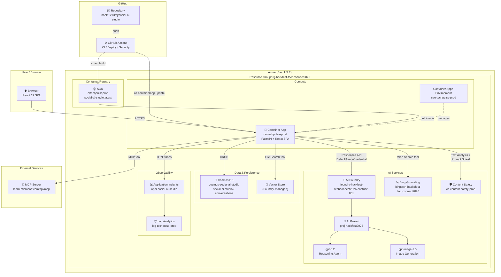
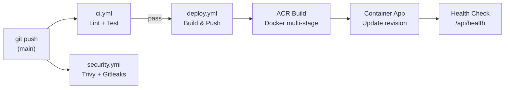

# Azure Architecture — Social AI Studio

> **Last updated**: 2026-02-12 (verified against live Azure resources)

## Overview

Social AI Studio runs on **Azure Container Apps** as a single-container deployment (multi-stage Docker: React frontend + Python backend). The agent leverages Microsoft Foundry's Responses API for reasoning (gpt-5.2) and image generation (gpt-image-1.5).

## Architecture Diagram



## Resource Inventory

| Resource | Type | Name | Purpose |
|----------|------|------|---------|
| **AI Foundry** | `CognitiveServices/accounts` | `foundry-hackfest-techconnect2026-eastus2-001` | AI Services account (hosts model deployments) |
| **AI Project** | `CognitiveServices/accounts/projects` | `proj-hackfest2026` | Foundry project (Responses API endpoint, agent tools) |
| **Bing Grounding** | `Bing/accounts` | `bingsrch-hackefest-techconnect2026` | Web search tool for real-time trend research |
| **Container Registry** | `ContainerRegistry/registries` | `crtechpulseprod` | Docker image registry (Basic SKU) |
| **Container Apps Env** | `App/managedEnvironments` | `cae-techpulse-prod` | Managed environment for Container Apps |
| **Container App** | `App/containerApps` | `ca-techpulse-prod` | Application host (single container: React + FastAPI) |
| **Cosmos DB** | `DocumentDB/databaseAccounts` | `cosmos-social-ai-studio` | Conversation history persistence |
| **Application Insights** | `Insights/components` | `appi-social-ai-studio` | Distributed tracing + metrics |
| **Log Analytics** | `OperationalInsights/workspaces` | `log-techpulse-prod` | Log aggregation (backing store for App Insights) |
| **Content Safety** | `CognitiveServices/accounts` | `cs-content-safety-prod` | Text moderation + prompt shield |

## Model Deployments

| Model | Deployment Name | Purpose |
|-------|----------------|---------|
| **gpt-5.2** | `gpt-5.2` | Reasoning agent (CoT → ReAct → Self-Reflection) |
| **gpt-image-1.5** | `gpt-image-1.5` | Social media visual generation |

## Networking & Authentication

| Aspect | Configuration |
|--------|--------------|
| **Ingress** | HTTPS (TLS auto-managed by Container Apps) |
| **App URL** | `https://ca-techpulse-prod.mangorock-56f29ae1.eastus2.azurecontainerapps.io/` |
| **Auth (app → AI)** | `DefaultAzureCredential` (Managed Identity in prod, Azure CLI locally) |
| **Token audience** | `https://ai.azure.com/.default` |
| **Container pull** | ACR admin credentials (Container App ↔ ACR) |

## CI/CD Pipeline



| Workflow | Trigger | Jobs |
|----------|---------|------|
| **CI (ci.yml)** | push / PR to main | Ruff lint → pytest (123 tests) → Frontend tsc + build |
| **Deploy (deploy.yml)** | push to main (after CI) | ACR build → Container App update → health check |
| **Security (security.yml)** | push / PR / weekly | Trivy scan → Gitleaks secret detection → dependency audit |

### GitHub Variables Required

| Variable | Description |
|----------|-------------|
| `AZURE_CLIENT_ID` | Service principal or managed identity client ID |
| `AZURE_TENANT_ID` | Azure AD tenant ID |
| `AZURE_SUBSCRIPTION_ID` | Azure subscription ID |

## Deployment

### Automated (recommended)

```bash
git push origin main
# → GitHub Actions: lint → test → build → deploy → health check
```

### Manual

```bash
# Build & push image
az acr build --registry crtechpulseprod \
  --image social-ai-studio:latest \
  --file Dockerfile .

# Update Container App
az containerapp update \
  -g rg-hackfest-techconnect2026 \
  -n ca-techpulse-prod \
  --image crtechpulseprod.azurecr.io/social-ai-studio:latest
```

### First-time setup (azd)

```bash
azd auth login
azd up
```

## Data Flow

```
User Input → Content Safety (Prompt Shield)
           → gpt-5.2 Agent (Responses API)
              ├── Web Search (Bing Grounding) → real-time trends
              ├── File Search (Vector Store) → brand guidelines
              ├── MCP Server → Microsoft Learn docs
              ├── generate_content → platform-specific text
              ├── review_content → 5-axis quality scoring
              └── generate_image (gpt-image-1.5) → visuals
           → Content Safety (Text Analysis)
           → SSE Stream → Browser
           → Cosmos DB (save conversation)
           → App Insights (OTel traces)
```

## Cost Considerations

| Resource | SKU / Tier | Billing Model |
|----------|-----------|---------------|
| Container Apps | Consumption | Pay-per-use (vCPU-seconds + memory) |
| ACR | Basic | Fixed monthly |
| Cosmos DB | Serverless | Per-RU consumed |
| AI Foundry / gpt-5.2 | Global Standard | Per 1K tokens |
| gpt-image-1.5 | Standard | Per image |
| Bing Search | S1 | Per 1K transactions |
| Content Safety | S0 | Per 1K transactions |
| Application Insights | Pay-as-you-go | Per GB ingested |
